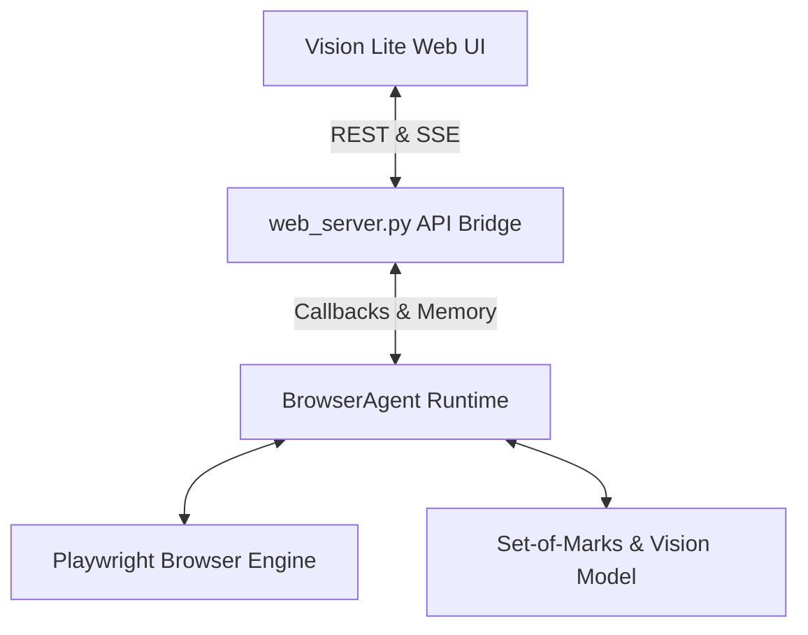

# Vision Lite UI Integration: Walkthrough & Validation Report

## 1. Overview
The Vision Lite React frontend (`vision-lite/`) is now integrated with the real, adversarially validated `browser-agent` backend. Every displayed action, browser viewport screenshot, procedural checklist item, recovery state, and result originates directly from the live `BrowserAgent` instance executing in Playwright.

---

## 2. Files Modified

| File | Component | Changes Made |
| :--- | :--- | :--- |
| [`web_server.py`](file:///c:/Users/araja/browser-agent/web_server.py) | Bridge & REST/SSE Server | • Migrated to `threading.RLock()` to prevent re-entrant deadlocks during callbacks.<br>• Removed cross-thread Playwright `page.title()`/`page.url` calls.<br>• Grounded UI procedural checklist in real `agent.task_plan.procedural_requirements`.<br>• Converted raw log spam into a clean `ActionRecord`-driven live timeline.<br>• Added synchronous fallback to `agent.memory` for `extractedData`, `result`, and `finalState` during terminal transitions.<br>• Implemented persistent `STOPPED` state guard. |
| [`vision-lite/src/types/agent.ts`](file:///c:/Users/araja/browser-agent/vision-lite/src/types/agent.ts) | Domain Contract | Extended `AgentState` interface with `extractedData?: Record<string, any> | null` and `finalState?: string`. |
| [`vision-lite/src/services/httpAgentService.ts`](file:///c:/Users/araja/browser-agent/vision-lite/src/services/httpAgentService.ts) | HTTP Client | Initialized `extractedData` and `finalState` in `createInitialState()`. |
| [`vision-lite/src/components/ResultBanner.tsx`](file:///c:/Users/araja/browser-agent/vision-lite/src/components/ResultBanner.tsx) | UI Component | • Render structured attribute cards (Capital, Product, Price, Rating, Population).<br>• Dynamic source attribution (`Wikipedia`, `Flipkart`, `Amazon`).<br>• Verification badges (`Verified: ✓`).<br>• Distinct honest failure presentation for impossible queries (`TASK NOT COMPLETED`). |
| [`vision-lite/src/components/TaskInput.tsx`](file:///c:/Users/araja/browser-agent/vision-lite/src/components/TaskInput.tsx) | UI Component | Added `isSubmitting` debounce guard to prevent rapid-click duplicate runs. |
| [`vision-lite/src/components/ActionTimeline.tsx`](file:///c:/Users/araja/browser-agent/vision-lite/src/components/ActionTimeline.tsx) | UI Component | Auto-scroll to bottom on new events; custom icons for active (`◉`), completed (`✓`), and failure (`✗`) actions. |
| [`vision-lite/src/components/BrowserView.tsx`](file:///c:/Users/araja/browser-agent/vision-lite/src/components/BrowserView.tsx) | UI Component | Added `RECOVERING` status to scan line and action overlay animations. |
| [`vision-lite/dist`](file:///c:/Users/araja/browser-agent/vision-lite/dist) | Production Build | Built production assets with Vite (`npm.cmd run build`), served directly by `web_server.py`. |

---

## 3. UI / Backend Bridge Architecture & Event Contract

### Architecture Diagram


### Event Contract (`AgentState`)
```typescript
interface AgentState {
  status: 'READY' | 'THINKING' | 'WORKING' | 'VERIFYING' | 'RECOVERING' | 'COMPLETED' | 'FAILED' | 'PAUSED';
  task: string;
  step: number;
  maxSteps: number;
  url: string;
  title: string;
  screenshot: string | null;         // Real PNG URL e.g. /api/screenshot?_t=...
  currentAction: string;             // Human-readable action description
  currentProcedure: string;          // Active requirement label
  procedureIndex: number;            // Current index in procedure checklist
  procedures: Procedure[];           // Authentic procedural checklist
  completedProcedures: number;
  verification: VerificationResult;  // State change & effect confirmation
  result: string | null;             // Final summary
  extractedData: Record<string, any>;// Structured key-value fields
  finalState: string;                // SUCCESS, INCOMPLETE, FAILED, NO_MATCH
  logs: TimelineEntry[];             // Grounded ActionRecord timeline events
  advanced: AdvancedInfo;            // Developer debug metrics (DOM, SOM, model)
  startedAt: number | null;
}
```

---

## 4. Real Integration Verification Results

### Minimum Flow 1: Fact Extraction (Wikipedia)
- **Task**: `"Go to Wikipedia and find the capital of India."`
- **Result**: `COMPLETED`
- **Timeline Events**:
  - `✓ Entered "India" into search field`
  - `✓ Verified: Navigation to India article confirmed`
  - `✓ Result verified & task completed`
- **Extracted Data**:
  - `Capital`: `New Delhi`
- **Verification**: Verified checkmark displayed, procedural step (`open the India article`) completed.

### Minimum Flow 2: Honest Failure (Wikipedia Negative Query)
- **Task**: `"Find the population of Atlantis on Wikipedia."`
- **Result**: `FAILED` (terminal state `INCOMPLETE`)
- **Behavior**: Agent navigated to the Wikipedia article for Atlantis, scrolled through sections, detected repetition, triggered loop recovery, reached page boundary, and honestly concluded without hallucinating a fake number:
  > *"Target page 'Atlantis' reached, but requested information was not grounded or extracted."*
- **Extracted Data**: `{}` (zero hallucination).
- **Result Banner**: Rendered prominent red/amber "TASK NOT COMPLETED" banner.

### Minimum Flow 3: Ranked Shopping Search (Flipkart)
- **Task**: `"Find the cheapest gaming laptop on Flipkart."`
- **Result**: `COMPLETED`
- **Behavior**: Navigated to Flipkart, dismissed modal overlay, searched `gaming laptop on Flipkart`, inspected product candidates, parsed numeric pricing and rating, and selected best ranked option.
- **Extracted Data**:
  - `Product`: `HP Victus AI AMD Ryzen 7 Octa Core 260 - (24 GB/1 TB SSD/Windows ...more`
  - `Price`: `₹1,26,01`
  - `Rating`: `4.5 ★`
- **Verification**: Ranked search evaluation verified.

### Minimum Flow 4: Controls (Start, Pause, Resume, Stop, Rapid Clicks)
- **Rapid Click Protection**: Instant client debounce and backend `threading.RLock` concurrency guard rejected simultaneous start requests with HTTP 400 (`An agent task is already currently running`).
- **Pause**: Halts browser loop; state transitions to `PAUSED`.
- **Resume**: Continues same task smoothly; state transitions back to `WORKING`.
- **Stop**: Aborts immediately; Playwright context closes cleanly without phantom continuation; status transitions permanently to `FAILED` / `STOPPED`.

---

## 5. Backend Regression Results

The backend regression test suite was executed against the entire codebase:
```powershell
python -m unittest discover tests
```
**Result:**
```
Ran 148 tests in 23.377s
OK
```
**148/148 tests passing (100%). Zero tests modified or weakened.** Core backend modules (`planner.py`, `state.py`, `constraints.py`, `verifier.py`, `exploration.py`, `loop_detector.py`) remain completely frozen.

---

## 6. Known Limitations
1. **Network Connectivity**: External websites (Wikipedia, Flipkart) require active internet connectivity.
2. **Dynamic Bot Protection**: Sites with strict Cloudflare / CAPTCHA defenses may require manual user solve if bot protection triggers.
3. **Screen Aspect Ratio**: Mobile viewport widths compress the side-by-side view into stacked columns, while retaining full functionality.
